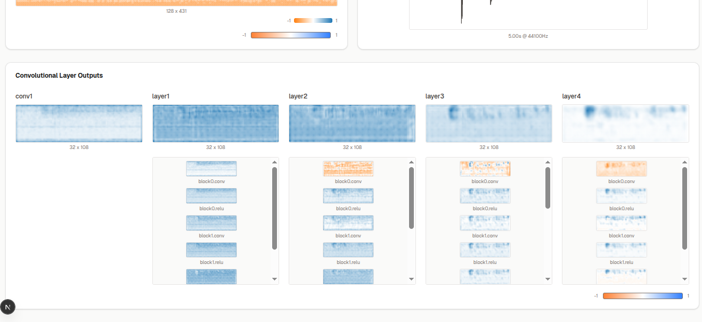

# 🎵 Audio Classification with Convolutional Neural Networks

<div align="center">


**A deep learning system for environmental sound classification using a ResNet-18 inspired architecture, trained on the ESC-50 dataset with cloud-native infrastructure.**

[Features](#-features) •
[Architecture](#-model-architecture) •
[Installation](#-installation) •
[Usage](#-usage) •
[Visualization](#-visualization-dashboard) •
[Documentation](#-documentation)

</div>

---

## 📋 Table of Contents

- [Overview](#-overview)
- [Features](#-features)
- [Model Architecture](#-model-architecture)
- [Project Structure](#-project-structure)
- [Installation](#-installation)
- [Usage](#-usage)
  - [Training](#training)
  - [Inference](#inference)
- [Visualization Dashboard](#-visualization-dashboard)
- [Technical Details](#-technical-details)
- [Future Directions](#-future-directions)
- [Acknowledgements](#-acknowledgements)
- [References](#-references)
- [License](#-license)

---

## 🌟 Overview

This project implements an **Environmental Sound Classification (ESC)** system using a custom Convolutional Neural Network architecture inspired by ResNet-18. The system processes audio files by converting them to Mel-Spectrograms and classifies them into 50 distinct categories from the ESC-50 dataset.

### Why CNNs for Audio?

Traditional approaches treat audio as 1D waveforms, but this loses critical information about frequency relationships. By converting audio to **Mel-Spectrograms**, we transform the problem into image classification, allowing CNNs to:

- **Detect temporal patterns** (horizontal filters): Rhythms, onsets, temporal evolution
- **Identify spectral patterns** (vertical filters): Harmonics, pitch, frequency bands
- **Achieve translational invariance**: Recognize sounds regardless of their position in time

---

## ✨ Features

| Feature | Description |
|---------|-------------|
| 🧠 **ResNet-18 Architecture** | Custom implementation with residual connections for deep learning stability |
| 🎼 **Mel-Spectrogram Processing** | Converts raw audio to frequency-time representations optimized for CNNs |
| ☁️ **Cloud-Native Training** | Serverless GPU infrastructure using Modal for scalable training |
| 📊 **Real-time Visualization** | Interactive Next.js dashboard for exploring model predictions and feature maps |
| 🔧 **Advanced Regularization** | Mixup augmentation, SpecAugment, dropout, and label smoothing |
| 📈 **TensorBoard Integration** | Comprehensive logging of training metrics and model performance |
| 🚀 **Production-Ready API** | FastAPI endpoint for real-time audio classification |

---

## 🏗 Model Architecture

### High-Level Overview

```
┌─────────────────────────────────────────────────────────────────────────────┐
│                           AudioCNN (ResNet-18 Variant)                       │
├─────────────────────────────────────────────────────────────────────────────┤
│                                                                              │
│  Input: Mel-Spectrogram (1 × 128 × 256)                                     │
│         └── 1 channel (grayscale), 128 mel bands, 256 time frames           │
│                                                                              │
│  ┌─────────────┐    ┌─────────────┐    ┌─────────────┐    ┌─────────────┐   │
│  │   Conv1     │───▶│   Layer 1   │───▶│   Layer 2   │───▶│   Layer 3   │   │
│  │  7×7, 64    │    │  64ch × 3   │    │ 128ch × 4   │    │ 256ch × 6   │   │
│  │  stride=2   │    │  ResBlocks  │    │  ResBlocks  │    │  ResBlocks  │   │
│  └─────────────┘    └─────────────┘    └─────────────┘    └─────────────┘   │
│         │                                                        │          │
│         ▼                                                        ▼          │
│  ┌─────────────┐                                         ┌─────────────┐    │
│  │  MaxPool    │                                         │   Layer 4   │    │
│  │   3×3       │                                         │ 512ch × 3   │    │
│  │  stride=2   │                                         │  ResBlocks  │    │
│  └─────────────┘                                         └─────────────┘    │
│                                                                 │           │
│                                                                 ▼           │
│                              ┌──────────────────────────────────────────┐   │
│                              │  AdaptiveAvgPool → Dropout(0.5) → FC(50) │   │
│                              └──────────────────────────────────────────┘   │
│                                                                              │
│  Output: 50-class probability distribution (ESC-50 categories)              │
│                                                                              │
└─────────────────────────────────────────────────────────────────────────────┘
```

### Residual Block Design

The core building block implements **skip connections** to solve the vanishing gradient problem:

```python
class ResidualBlock(nn.Module):
    def forward(self, x):
        out = torch.relu(self.bn1(self.conv1(x)))
        out = self.bn2(self.conv2(out))
        out += self.shortcut(x)  # Identity mapping (skip connection)
        return torch.relu(out)
```

**Why Skip Connections?**
- **Forward Pass**: Allows identity mapping when complex transformations are unnecessary
- **Backward Pass**: Acts as a "gradient distributor," preventing training stalls in deep networks

### Dimension Flow

| Stage | Output Shape | Description |
|-------|-------------|-------------|
| Input | `B × 1 × 128 × 256` | Mel-spectrogram |
| Conv1 + MaxPool | `B × 64 × 32 × 64` | Initial feature extraction |
| Layer 1 | `B × 64 × 32 × 64` | Low-level patterns |
| Layer 2 | `B × 128 × 16 × 32` | Mid-level features |
| Layer 3 | `B × 256 × 8 × 16` | High-level features |
| Layer 4 | `B × 512 × 4 × 8` | Abstract representations |
| AvgPool | `B × 512 × 1 × 1` | Spatial summary |
| FC | `B × 50` | Class predictions |

---

## 📁 Project Structure

```
Convolutional-Neural-Network/
├── 📄 model.py                 # CNN architecture (ResidualBlock, AudioCNN)
├── 📄 train.py                 # Training pipeline with Modal infrastructure
├── 📄 main.py                  # Inference API with FastAPI endpoint
├── 📄 requirements.txt         # Python dependencies
│
├── 📂 audio-cnn-app/           # Next.js visualization dashboard
│   ├── 📂 src/
│   │   ├── 📂 app/
│   │   │   ├── page.tsx        # Main application page
│   │   │   └── layout.tsx      # Root layout
│   │   ├── 📂 components/
│   │   │   ├── FeatureMap.tsx  # CNN activation visualizer
│   │   │   ├── Waveform.tsx    # Audio waveform display
│   │   │   └── ColorScale.tsx  # Visualization color scale
│   │   └── 📂 lib/
│   │       ├── colors.ts       # Color utilities
│   │       └── utils.ts        # Helper functions
│   ├── package.json
│   └── tsconfig.json
│
├── 📂 tensorboard_logs/        # Training metrics and visualizations
│
└── 📂 sample_audio/            # Example audio files for testing
    ├── Thunderstorm.wav
    ├── chirping-birds.wav
    └── drilling-sound.wav
```

---

## 🔧 Installation

### Prerequisites

- Python 3.10+
- Node.js 18+ (for visualization dashboard)
- Modal account (for cloud training)
- CUDA-capable GPU (optional, for local training)

### Backend Setup

```bash
# Clone the repository
git clone https://github.com/Tweenwrld/convolutional-neural-network.git
cd convolutional-neural-network

# Create virtual environment
python -m venv .venv
source .venv/bin/activate  # On Windows: .venv\Scripts\activate

# Install dependencies
pip install -r requirements.txt

# Configure Modal (for cloud training)
modal token new
```

### Frontend Setup

```bash
# Navigate to the visualization app
cd audio-cnn-app

# Install dependencies
pnpm install  # or npm install

# Start development server
pnpm dev
```

---

## 🚀 Usage

### Training

The training pipeline uses Modal's serverless infrastructure with NVIDIA A10G GPUs:

```bash
# Run training on Modal's cloud infrastructure
modal run train.py
```

**Training Configuration:**

| Hyperparameter | Value | Description |
|----------------|-------|-------------|
| Optimizer | AdamW | Decoupled weight decay regularization |
| Learning Rate | 0.0005 → 0.002 | OneCycleLR with warmup |
| Weight Decay | 0.01 | L2 regularization |
| Batch Size | 32 | Balanced memory/gradient estimation |
| Epochs | 100 | Full training cycle |
| Label Smoothing | 0.1 | Prevents overconfidence |
| Dropout | 0.5 | Regularization before FC layer |

**Data Augmentation:**

- **Mixup** (α=0.2, 70% probability): Interpolates training examples
- **SpecAugment**: Frequency masking (30 bands) + Time masking (80 steps)

### Inference

The inference API is deployed as a serverless FastAPI endpoint:

```bash
# Deploy inference endpoint
modal deploy main.py
```

**Python Example:**

```python
import requests
import base64

# Read and encode audio file
with open("audio.wav", "rb") as f:
    audio_b64 = base64.b64encode(f.read()).decode()

# Send inference request
response = requests.post(
    "https://your-modal-endpoint/inference",
    json={"audio_data": audio_b64}
)

result = response.json()
print(result["predictions"])  # Top-3 predictions with confidence scores
```

**Response Structure:**

```json
{
  "predictions": [
    {"class": "rain", "confidence": 0.847},
    {"class": "thunderstorm", "confidence": 0.092},
    {"class": "water_drops", "confidence": 0.031}
  ],
  "visualization": {
    "conv1": {"shape": [32, 64], "values": [[...]]},
    "layer1": {"shape": [32, 64], "values": [[...]]}
  },
  "input_spectrogram": {"shape": [128, 256], "values": [[...]]},
  "waveform": {"values": [...], "sample_rate": 44100, "duration": 5.0}
}
```

---

## 📊 Visualization Dashboard

The Next.js application provides an interactive interface for exploring model behavior:

<div align="center">



</div>

### Features

1. **Audio Upload**: Drag-and-drop WAV file upload
2. **Prediction Display**: Top-3 classifications with confidence bars
3. **Waveform Visualization**: Time-domain audio representation
4. **Spectrogram View**: Mel-spectrogram input to the CNN
5. **Feature Map Explorer**: Intermediate layer activations (conv1 → layer4)

### Running the Dashboard

```bash
cd audio-cnn-app
pnpm dev
# Navigate to http://localhost:3000
```

---

## 🔬 Technical Details

### Signal Processing Pipeline

```
Raw Audio (.wav)
    │
    ▼
Resampling (44.1kHz)
    │
    ▼
Mono Conversion (if stereo)
    │
    ▼
Short-Time Fourier Transform (STFT)
    │  n_fft=2048, hop_length=512
    ▼
Mel Filterbank (128 bands, 0-22050Hz)
    │
    ▼
Amplitude to Decibels (log-scale)
    │
    ▼
Mel-Spectrogram (1 × 128 × 256)
```

### Why Mel Scale?

The Mel scale mimics human auditory perception:
- **Higher resolution** at low frequencies (100-1000 Hz) where humans are most sensitive
- **Compressed representation** at high frequencies (10kHz+)
- CNNs can learn features that align with how humans perceive sound

### ESC-50 Dataset

The [Environmental Sound Classification (ESC-50)](https://github.com/karolpiczak/ESC-50) dataset contains:

- **2000 audio clips** (5 seconds each)
- **50 semantic classes** across 5 major categories:
  - Animals (dog, cat, crow, etc.)
  - Natural soundscapes (rain, sea waves, wind)
  - Human non-speech sounds (coughing, sneezing, laughing)
  - Interior/domestic sounds (clock tick, door knock)
  - Exterior/urban noises (helicopter, siren, engine)

**Training Split**: Folds 1-4 (1600 samples) | **Validation**: Fold 5 (400 samples)

---

## 🔮 Future Directions

### 1. Audio Spectrogram Transformers (AST)
Transformer architectures have surpassed CNNs on ESC-50, achieving >98% accuracy through self-attention mechanisms that capture global dependencies.

### 2. Hierarchical Classification
Two-level classification systems where a Level 1 classifier determines broad categories (e.g., "Animals"), and specialized Level 2 classifiers make fine-grained distinctions.

### 3. Transfer Learning & Foundation Models
Pre-training on large-scale datasets (AudioSet) or using self-supervised learning (masked autoencoders) significantly improves performance on limited datasets like ESC-50.

---

## 🙏 Acknowledgements

Special thanks to **Andreas Trolle** for his invaluable guidance and support in understanding the theoretical foundations and practical implementation aspects of this project. His expertise in deep learning and signal processing was instrumental in bringing this system to life.

---

## 📚 References

1. **He, K., Zhang, X., Ren, S., & Sun, J.** (2016). Deep Residual Learning for Image Recognition. *CVPR*. [arXiv:1512.03385](https://arxiv.org/abs/1512.03385)

2. **Piczak, K. J.** (2015). ESC: Dataset for Environmental Sound Classification. *Proceedings of the 23rd ACM international conference on Multimedia*. [GitHub](https://github.com/karolpiczak/ESC-50)

3. **Zhang, H., Cisse, M., Dauphin, Y. N., & Lopez-Paz, D.** (2018). mixup: Beyond Empirical Risk Minimization. *ICLR*. [arXiv:1710.09412](https://arxiv.org/abs/1710.09412)

4. **Park, D. S., et al.** (2019). SpecAugment: A Simple Data Augmentation Method for Automatic Speech Recognition. *Interspeech*. [arXiv:1904.08779](https://arxiv.org/abs/1904.08779)

5. **Recent ArXiv Submissions** (2024): Methodologies on Hierarchical Classification and Transformer-based Audio Analysis.

---

## 📄 License

This project is licensed under the MIT License - see the [LICENSE](LICENSE) file for details.

---

<div align="center">

**Built with ❤️ using PyTorch, Modal, and Next.js**

[⬆ Back to Top](#-audio-classification-with-convolutional-neural-networks)

</div>
